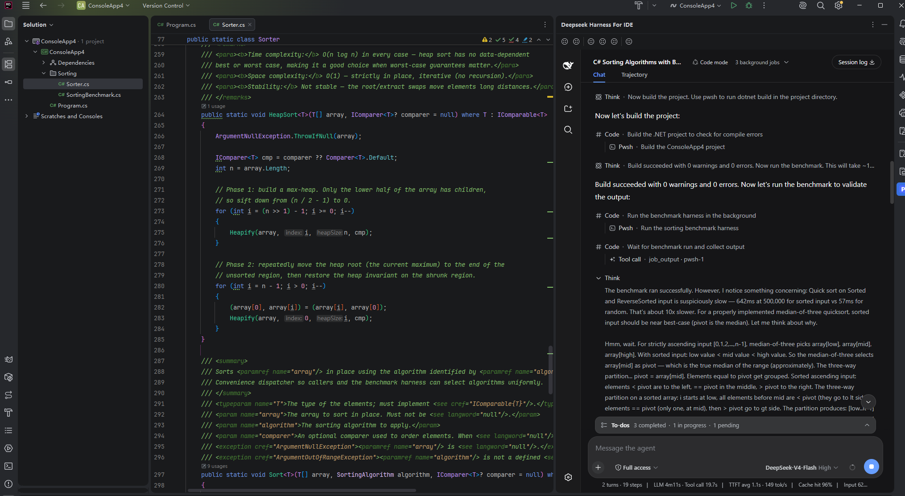

<div align="center">

# Deepseek Harness For IDE

> The full DeepSeek Harness inside your JetBrains IDE


**English** · [简体中文](./README.md)

![][github-stars-shield] ![][github-forks-shield] ![][github-issues-shield] ![][github-mit]

</div>

> DeepSeek Harness is DeepSeek's agentic coding harness — agent chat, tool approvals, goals & plans,
> subagents, workflows and Cordis tooling. This plugin embeds the **complete** harness in the IDE tool
> window: install, configure the API key once, chat.



---

## Installation

### From disk (zip)

1. Download `deepseek-harness-jetbrains-<version>.zip` from
   [Releases](https://github.com/JayZz210l/deepseek-harness-for-ide/releases)
   (or build it yourself — see [Building from source](#building-from-source)).
2. Open your IDE and go to **Settings → Plugins** (Ctrl+Alt+S, or File → Settings).
3. Click the **⚙ gear** icon next to "Marketplace" and choose **Install Plugin from Disk…**.
4. Select the downloaded zip and click **OK**.
5. Restart the IDE when prompted.
6. Open any project — the **Deepseek Harness For IDE** tool window appears on the right
   and the local service starts automatically.

**Upgrading:** install the newer zip the same way — it replaces the previous version while
keeping your per-project conversations and settings.

### From the JetBrains Marketplace

Search for **Deepseek Harness For IDE** under **Settings → Plugins → Marketplace** and
install it. Marketplace releases follow the same version numbers.

---

## Key Features

### The whole harness, embedded
- **Full DeepSeek Harness web UI** — agent chat, session management, tool approvals, file
  diffs, goals & plans, subagents, workflows and the Cordis tool panels, in a JCEF browser
  inside the tool window. DSH upgrades automatically bring new UI features.
- **No dsh install required** — the plugin ships the complete DSH runtime (its whole
  `node_modules` closure). Only Node.js 18+ is required, and when it is missing the plugin
  detects it and pops a one-click link to nodejs.org.

### IDE integration
- **Workspace = IDE project** — the project directory is adopted as a workspace and moved to
  the top before the page loads; reopening deterministically lands on the workspace with the
  most conversations. `~/.dsh/.agent-presets` are synced at startup and a blank session is
  prepared when needed, so the selection also wins under newer DSH releases that auto-select
  the most recently active workspace.
- **No external browser tab** — newer `dsh web` releases open the default browser on startup;
  the plugin passes `--no-open` whenever the resolved runtime supports it (probed once via
  `dsh web --help` for external installs; older dsh versions are unaffected).
- **Open files in the IDE** — `host.openPath` is routed into the IDE via a DSH composition
  patch (native gateway) with an automatic fallback to a TCP proxy. The `--patch` flag layout
  follows the launcher contract of both old and new DSH releases.
- **Native IDE diff** — when a file has VCS changes, opening it shows the IDE's side-by-side
  diff against the VCS baseline instead of the plain editor.
- **Send selection to DSH** — editor context-menu action that starts the service if needed,
  locates the session, and queues the selected text (or current line) as a message.

### Data safety & isolation
- **Per-project isolated data** — every IDE project gets its own DSH home; credentials and
  settings are inherited one-way from `~/.dsh` at startup. An externally running `dsh web`
  is never touched (multi-instance sharing of one home is unsafe in DSH).
- **Startup checks** — API-key preflight (warns before the first dead turn), Node.js
  18+ execution/version validation with live Windows environment refresh and download
  guidance, and a once-per-version update notice with the build date and what changed.
- **One-click plugin & preset sync** — plugins installed in the terminal with
  `dsh plugin --profile web add <pkg>` (under `~/.dsh`) and locally authored
  agent presets (`~/.dsh/.agent-presets`) are copied into the current IDE
  project's isolated home with one click in the web UI: DSH settings → **For IDE** →
  **Sync plugins / Sync presets**. Plugin sync restarts the service automatically
  and rolls back on failure; preset sync needs no restart. **Reset plugins**
  restores the shipped default profile.

### Developer experience
- **"For IDE" settings section** inside the DeepSeek Harness settings page — plugin info and
  feedback links, injected through the composition (a real DSH client package).
- **Feedback built in** — a feedback button in the tool-window toolbar, plus a plugin-info
  section with one-click diagnostics copy on the IDE settings page.
- **Logs & statistics** — start/crash counters, uptime, and the captured `dsh web` log in the
  tool window. Fully bilingual (English / 简体中文).

---

## Requirements

- JetBrains IDE **2024.3+** (`since 243 / until 262.*`) — IntelliJ IDEA, PyCharm, WebStorm,
  GoLand, Rider, and other platform-based IDEs.
- **Node.js 18+** — the DSH runtime is bundled; Node is not. The plugin prompts you to
  download it when missing.
- A **DeepSeek API key** — run `npx @deepseek-ai/dsh web` once in a terminal, save
  `DEEPSEEK_API_KEY` on the Models page; the plugin inherits it automatically.

> **Platform note:** the bundled DSH runtime contains native modules (node-pty, sharp, …) and
> is currently built for **Windows x64**. On other platforms a system-installed `dsh` on PATH
> is used instead (see the settings table below).

---

## Usage

| Action | How |
| --- | --- |
| Chat / approve tools / manage sessions | Everything happens inside the embedded Harness UI |
| Open a file changed by the agent | Click the file in the chat → opens in the IDE editor, or the **IDE native diff** when it has VCS changes |
| Send code to DSH | Select code → right-click → **Send Selection to DeepSeek Harness** |
| Sync plugins / presets from `~/.dsh` | In the embedded UI: Settings → **For IDE** → **Sync plugins** / **Sync presets** |
| Reset plugins to defaults | Settings → **For IDE** → **Reset plugins** |
| Start / stop / restart the service | Toolbar buttons in the tool window |
| Logs & statistics | Toolbar **Show Details** → Log / Statistics tabs |
| Report a problem | Toolbar **Feedback** button, or Settings → **Deepseek Harness For IDE** → **Report a problem / Copy diagnostics** |

## Settings

**Settings → Tools → Deepseek Harness For IDE**

| Setting | Default | Description |
| --- | --- | --- |
| dsh command | `dsh` | The bundled runtime is used automatically; a `dsh` found on PATH wins. A full path (e.g. `C:\nodejs\node.exe C:\...\dsh\lib\bin.js`) is also accepted |
| Bind address | `127.0.0.1` | Passed to `dsh web --host` (DSH rejects `0.0.0.0`) |
| Port | `0` (auto) | `0` = let the OS pick a free port (recommended) |
| File jump | `auto` | How "open file" resolves: `auto` = DSH composition-native gateway with TCP-proxy fallback; `proxy` = TCP proxy only; `off` = disabled |
| File open mode | `auto` | How the file lands: `auto` = IDE native diff (VCS baseline) when modified, else the editor; `file` = always the editor |
| DSH_HOME override | blank (isolated) | Blank = per-project isolated directory under `%LOCALAPPDATA%\deepseek-harness-jetbrains\dsh-home\<project>-<hash>` (recommended; credentials are inherited one-way from `~/.dsh`); `default` = inherit the IDE environment (shares `~/.dsh` with an external `dsh web` — not multi-instance safe); an absolute path uses that directory |
| Auto start on project open | ✅ | One DSH instance per project |
| Auto restart on unexpected exit | ❌ | Re-spawns the service when it crashes |

> ⚠️ Sharing one DSH home between several `dsh web` instances is not safe in the current DSH
> version. The isolated default keeps the plugin and any external `dsh web` fully independent.

---

## Project Status

The project is under active development. For version history and iteration progress, read
[CHANGELOG.md](CHANGELOG.md).

---

## Building from source

Prerequisites: JDK 17+ (21/22 recommended). First build downloads the IntelliJ Platform
dependencies and bundles the DSH runtime from the local npx cache — run
`npx --yes @deepseek-ai/dsh@0.1.1-rc.1 --version` once so the required DSH installation exists.

```powershell
.\gradlew.bat buildPlugin      # → build/distributions/deepseek-harness-jetbrains-0.1.13.zip
.\gradlew.bat runIde           # run a sandbox IDE with the plugin
.\gradlew.bat verifyPlugin     # platform verification before publishing
```

Build options:

| Property | Effect |
| --- | --- |
| `-PdshRuntimePath=<dir>` | Use a specific dsh installation (dir containing `node_modules`) for bundling |
| `-PskipDshRuntime=true` | Build a lightweight plugin without the bundled DSH runtime |
| `-PskipNodeRuntime=false` | Opt back into bundling a Node.js executable (`-PnodeRuntimePath=<dir>` points at the install) |

## Architecture

Plugin = process host (Kotlin) + embedded browser (JCEF) + the official DSH web frontend.
See [docs/architecture.md](docs/architecture.md) for the full write-up, including the
composition-patch reverse-engineering notes (gateway rebuild, `ctx.provide` check-predicate
pitfall, the h2c upgrade trap, the client-module injection for the "For IDE" section) and the
per-project data-home design.

## Roadmap

- [ ] Multi-project sharing of one DSH instance (optional mode)
- [ ] Native IDE directory picker for the UI's directory-selection seam
- [ ] One-shot tasks via `dsh --profile headless`
- [ ] Publish to the JetBrains Marketplace

---

## Feedback

- Tool window → **Feedback** (or Settings → **Deepseek Harness For IDE** → **Report a problem**).
- The feedback URL lives in
  [`DshFeedback.kt`](src/main/kotlin/com/deepseek/dsh/ide/ui/DshFeedback.kt) (`FEEDBACK_URL`).
- **Copy diagnostics** on the settings page snapshots version, build date, bundled DSH
  version, data directory, IDE and OS — paste it into your bug report.

---

## License

MIT — see [LICENSE](LICENSE). This plugin bundles the
[DeepSeek Harness](https://github.com/deepseek-ai/deepseek-harness) runtime (MIT); the
harness and its trademarks belong to their respective owners.

<!-- LINK GROUP -->

[github-stars-shield]: https://img.shields.io/github/stars/JayZz210l/deepseek-harness-for-ide?color=4D6BFE&labelColor=black&style=flat-square
[github-forks-shield]: https://img.shields.io/github/forks/JayZz210l/deepseek-harness-for-ide?color=8ae8ff&labelColor=black&style=flat-square
[github-issues-shield]: https://img.shields.io/github/issues/JayZz210l/deepseek-harness-for-ide?color=ff80eb&labelColor=black&style=flat-square
[github-mit]: https://img.shields.io/badge/github-MIT-4D6BFE?logo=github
